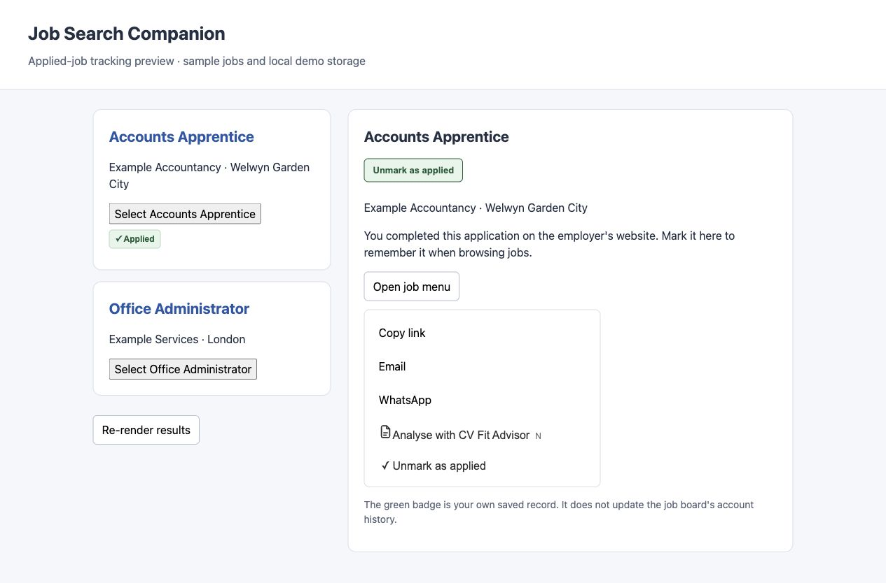

# Job Search Companion

[](https://github.com/MrLawrenceAwe/job-search-companion/actions/workflows/ci.yml)

A Chrome extension for browsing Indeed and LinkedIn, remembering applications, marking unsuitable jobs,
and sending selected jobs to a local Codex workspace for CV fit checks.

**Stack:** JavaScript, Node.js, Chrome Manifest V3, Swift and macOS Accessibility.



*Preview uses sample jobs and separate local demo storage. CV analysis is disabled.*

## What it does

- Adds **Mark as applied** and **Unmark as applied** to supported job menus and
  detail headers, with a green **✓ Applied** badge on result cards.
- Adds **Mark as unsuitable** and **Unmark as unsuitable** to job menus and
  detail headers, with an orange **✕ Unsuitable** badge. Jobs remain visible for
  review, and existing applied records are kept.
- Keeps applied and unsuitable marks across page refreshes and Chrome restarts, and updates
  open tabs together. Platform job IDs identify records across tracking URLs.
- Provides **J/K** to navigate rendered results, **H** to hide a result on the
  current page, and **U** to undo navigation or hiding. Shortcuts ignore editable
  fields; hidden results return after reload.
- Checks loaded Indeed descriptions for blockers against the verified profile using ChatGPT plan usage. Connect and enable it in extension settings; see [blocker checker](docs/blocker-checker.md).
- Adds **Analyse with CV Fit Advisor** and the **N** shortcut to prepare a CV fit
  task through a local service and a Swift Accessibility helper.

Application marks are manual local records. After applying on an employer's
website, mark its listing yourself; this does not update Indeed or LinkedIn's
application history or submit an application.

## Try the synthetic preview

No job-board account, CV, Codex installation or bridge is needed for the preview.
From the repository directory:

```sh
python3 -m http.server 48974 --bind 127.0.0.1
```

Open [the local preview](http://127.0.0.1:48974/test-support/job-marks-preview.html).
Select a sample job, open its menu and mark it as applied or unsuitable. Refresh or use
**Re-render results** to see the saved badge restored. The preview uses the
production content scripts with mock Chrome APIs; CV analysis stays disabled.
Stop the server with **Ctrl+C** when finished.

See [architecture and design](docs/design.md) for module boundaries, persistence,
task automation, and installation recovery.

## Install

Load `extension/` through Chrome's **Load unpacked** control for job
marking and browsing shortcuts. Blocker checking needs the local Node bridge and an eligible ChatGPT connection. CV analysis additionally requires macOS, Node.js
22+, Xcode Command Line Tools, Codex, Accessibility permission and a configured
`cv-fit-advisor` skill. The skill and CV files are not included in this repository.

After updating, reload the unpacked extension in Chrome and refresh job pages.

Follow [setup, configuration and removal](docs/setup.md) for the bridge, extension
identity, token, workspace and permissions. This is an independent personal
project, not affiliated with Indeed, LinkedIn or OpenAI.

## Tests and CI

Requires macOS, Node.js 22+ and Xcode Command Line Tools. Install dependencies with `npm ci` before running the bridge or tests. Installation records the current Node executable's absolute path so the background service uses the same runtime as the installer. Reinstall the bridge if that executable moves.

```sh
npm test
```

This type-checks the Swift helper and runs Node's built-in test runner. Tests use
synthetic jobs, mock browser APIs and temporary installation fixtures. Tests mirror
the source boundaries under `test/extension/`, `test/bridge/` (including blockers
and Codex), `test/installer/`, and `test/shared/`. Shared fixtures, VM/JSDOM script
loaders, and distinct event-loop draining and timed waiting helpers live in
`test-support/`. They cover
job resolution, applied and unsuitable mark persistence, navigation, HTTP authentication,
submission recovery and installation transactions. CI runs the same command on
macOS for pushes and pull requests using Node.js 22 and 24.

The suite does not prove compatibility with every live job-board layout or Codex
version. Real Accessibility permissions and end-to-end task submission need a
manual check on the target Mac; see [the setup guide](docs/setup.md#3-verify).

## Privacy and limitations

Applied and unsuitable marks stay in this Chrome profile's extension storage. Removing the
extension clears them. Job-board layout changes can break integrations; only
rendered results are available to the navigation shortcuts.

CV analysis sends the selected job URL to `127.0.0.1:48973`, then prepares a task
in your configured Codex workspace. CV handling follows that workspace's skill
and Codex account configuration. The bridge stores submission status and rotating
logs locally; it does not make applications on your behalf.
